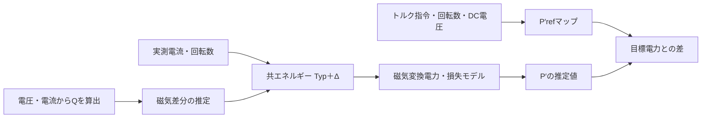

はい。**「Typ磁束を基準に、Qの観測から磁束差分を推定し、補正後の磁束をP側へ渡す」**というモデルとして組めます。

設計の中心は、**Δλd・Δλqの関係をどう表すか**になります。

## 1. 無効エネルギーの観測式

文献の式(12)に対応する関係を、これまでと同じ電力不変dq規約で書きます。基本波の準定常状態、電気角速度 \(\omega_e\neq0\) を出発点とすると、

\[
Q=v_qi_d-v_di_q
\]

\[
\boxed{
E_Q=\frac{Q}{\omega_e}
=i_d\lambda_d+i_q\lambda_q
}
\]

です。抵抗による電圧降下は、この組合せで相殺されます。:codex-file-citation{path="/Users/ochiba/.codex/attachments/1e5eb53c-22cf-4f3d-9568-a437eaf9504f/memo .pdf" purpose="source"}

磁束を、

\[
\boldsymbol{\lambda}
=
\boldsymbol{\lambda}_{\mathrm{Typ}}(i_d,i_q,\omega_e)
+\Delta\boldsymbol{\lambda}
\]

と置けば、Typからの観測残差は、

\[
\boxed{
y=E_{Q,\mathrm{obs}}
-i_d\lambda_{d,\mathrm{Typ}}
-i_q\lambda_{q,\mathrm{Typ}}
=i_d\Delta\lambda_d+i_q\Delta\lambda_q
}
\]

となります。**磁束差分に対して線形な観測式**です。

## 2. まず書けるKFモデル

例えば、

\[
\boldsymbol{x}_k=
\begin{bmatrix}\Delta\lambda_{d,k}\\\Delta\lambda_{q,k}\end{bmatrix},
\qquad
\boldsymbol{x}_{k+1}=\boldsymbol{x}_k+\boldsymbol{w}_k
\]

\[
y_k=
\underbrace{\begin{bmatrix}i_{d,k}&i_{q,k}\end{bmatrix}}_{H_k}
\boldsymbol{x}_k+\nu_k
\]

とすれば、通常の線形KFの形になります。

ただし、この状態遷移は「扱う時間・運転範囲では、磁束差分がゆっくり変わる」という仮定です。運転点で差分が大きく変わる場合は、その依存性もモデルへ入れる必要があります。

## 3. 文献から取り込みたい要点

固定電流では、Qから分かるのは

\[
i_d\Delta\lambda_d+i_q\Delta\lambda_q
\]

という一つの組合せです。一方、P側に必要なのは、

\[
P_{\mathrm{em}}
=\omega_e(\lambda_di_q-\lambda_qi_d)
\]

という別の組合せです。**自由な二つの磁束差分は、固定点のQだけでは一意に決まりません。**

文献では、両軸の磁束を**共通の磁石温度と、事前に求めた運転点別の係数**で結び付けています。この関係が、Qから両軸磁束を求めるための情報になっています。

Typ＋Δでも、例えば根拠のある補正方向 \(b_d,b_q\) を用意できれば、

\[
\begin{bmatrix}\Delta\lambda_d\\\Delta\lambda_q\end{bmatrix}
=
\begin{bmatrix}b_d(i_d,i_q,\omega_e)\\b_q(i_d,i_q,\omega_e)\end{bmatrix}\theta
\]

\[
y=(i_db_d+i_qb_q)\theta+\nu
\]

というモデルを考えられます。ここで推定する \(\theta\) は、磁束変化を両軸に共通して表す状態です。温度そのものにするか、磁束補正量にするかは今後の設計事項です。

## 4. P側への接続

推定した磁束を使い、準定常状態では、

\[
\boxed{
\hat R_s=
\frac{P_{\mathrm{obs}}
-\omega_e(\hat\lambda_di_q-\hat\lambda_qi_d)}
{i_d^2+i_q^2}
}
\]

へつなげられます。

実際の観測には電圧誤差が残ります。また、過渡時の \(E_Q\) には

\[
\frac{i_d\dot\lambda_q-i_q\dot\lambda_d}{\omega_e}
\]

が加わるため、これを磁束差分へ吸収させない扱いが必要です。

**試作2では、このTyp＋Δの観測式を出発点にし、「両軸の差分を結ぶ物理的な関係」を定めるのが次の一歩です。** そこが決まると、必要な状態数と、KFで何を推定するかが具体化できます。
----
「両軸の差分を結ぶ物理的な関係」

はい。文献を追うと、**「両軸の差分を直接 2 変数として推定する」のではなく、両軸を動かしている共通の物理状態を 1 つ置く**、という方向がかなり明確に見えてきます。

特に今回の `Typ + Δ` 構成には、かなり相性のよい先行研究があります。

## 1. 元論文が実際にやっていること

添付の Jung & Oh 論文を改めて見ると、実は

$$
\Delta\lambda_q=k\,\Delta\lambda_d
$$

のような直接的な拘束を置いているわけではありません。

論文では各運転点において、

$$
\lambda_d(T_{\rm mag})
 = d_2T_{\rm mag}^2+d_1T_{\rm mag}+d_0
$$

$$
\lambda_q(T_{\rm mag})
 = q_2T_{\rm mag}^2+q_1T_{\rm mag}+q_0
$$

と、**両軸磁束を共通の磁石温度 \(T_{\rm mag}\) の関数にしています**。その結果、

$$
E_{\rm react}
=i_d\lambda_d(T_{\rm mag})+
 i_q\lambda_q(T_{\rm mag})
$$

も \(T_{\rm mag}\) だけの関数になり、Q という 1 観測から 1 状態を推定できます。Fig. 4 では温度上昇に対して d 軸磁束が低下する一方、q 軸磁束は増加しており、単純な「両軸同率スケーリング」ではないことも重要です。

つまり幾何学的には、

$$
(\lambda_d,\lambda_q)
$$

が自由な二次元平面を動くのではなく、**温度を媒介変数とする一次元曲線上だけを動く**ようにしている、と理解するのがよいです。

Typ 近傍なら、これはまさに

$$
\boxed{
\begin{bmatrix}
\Delta\lambda_d\\
\Delta\lambda_q
\end{bmatrix}
\simeq
\begin{bmatrix}
\displaystyle\frac{\partial\lambda_d}{\partial T}\\[2mm]
\displaystyle\frac{\partial\lambda_q}{\partial T}
\end{bmatrix}_{\rm Typ}
\Delta T
}
$$

です。

したがって、以前書いた

$$
\Delta\boldsymbol{\lambda}
=
\boldsymbol b(i_d,i_q)\theta
$$

という形は、かなり自然な文献ベースのモデルです。

---

## 2. 「両軸を結ぶ関係」として有力な文献群

| 考え方                   | 両軸を結ぶ物理                                                                     | 今回への示唆                                                                                                                                                      |
| --------------------- | --------------------------------------------------------------------------- | ----------------------------------------------------------------------------------------------------------------------------------------------------------- |
| **共通の磁石温度**           | \(\lambda_d=f_d(T),\lambda_q=f_q(T)\)                                       | Jungらの方式そのもの。2021年の先行論文では、磁石温度に伴う PM 磁束だけでなくインダクタンス変化まで reactive energy に含めることで感度を高めています。([IEEE Xplore][1])                                                 |
| **共通の残留磁束密度 \(B_r\)** | \(\lambda_d=f_d(i_d,i_q,B_r),\lambda_q=f_q(i_d,i_q,B_r)\)                   | 中津川・岩路・榎本の2016年論文が非常に重要です。磁気飽和・軸間干渉モデルの各係数を \(B_r\) の関数にし、両軸磁束面を共通の \(B_r\) で変形しています。                                                                       |
| **PM励磁量という1パラメータ**    | 温度→PM励磁状態→両軸磁束                                                              | Srinivasanらの2026年 IEEE TEC 論文は、PMを単なる d 軸 flux source ではなく「current source」として扱い、飽和と温度効果を分離しつつ、温度変化を表す**単一パラメータの適応推定**を狙っています。今回にかなり近いです。([ResearchGate][2]) |
| **共エネルギー**            | \(\lambda_d=\partial W'/\partial i_d,\ \lambda_q=\partial W'/\partial i_q\) | 両軸を独立に作らず、1つのスカラー場から生成する。相反条件・cross saturation が自動的に整合します。Jebaiら、Suらが基礎。([ResearchGate][3])                                                                 |
| **温度依存共エネルギーマップ**     | \(W'=W'(i_d,i_q,\theta_r,T_{\rm mag})\)                                     | Capitanioら2025年は、FEAの共エネルギーを \(i_d,i_q,\) rotor angle, PM temperature の4変数で持ち、微分して磁束と増分インダクタンスを生成しています。今回の「温度モード＋共エネルギー」のほぼ完成形です。([Cris][4])                |
| **拘束を置かず励振で識別**       | 運転点・電流方向を変えて rank を作る                                                       | もう一つの道。新中論文は PS 信号で複数パラメータを識別可能にしています。これは「両軸を物理的に結ばないなら、情報を追加する必要がある」という対照例です。                                                                              |

---

## 3. 特に重要なのが中津川らの2016年論文

これは今回かなり参考になります。

この論文は \(\phi_d,\phi_q\) を \(i_d,i_q\) の非線形関数として表し、磁気飽和と dq 軸間干渉をモデル化しています。その上で温度変化を調査し、**温度そのものより物理的に一段下の原因である永久磁石の残留磁束密度 \(B_r\)** を共通変数として使っています。

興味深いのは、FEM解析から、

$$
I_0,\phi_0 \propto B_r
$$

となる一方、一部の cross-saturation 関係はほぼ固定、その他の飽和係数は \(B_r\) の一次関数で近似できる、と整理していることです。つまり、

$$
B_r
\longrightarrow
\{\text{飽和係数群}\}
\longrightarrow
(\lambda_d,\lambda_q)
$$

という**共通原因モデル**です。

これは今回なら、

$$
\theta
=
\frac{B_r-B_{r,\rm Typ}}{B_{r,\rm Typ}}
$$

として、

$$
\boxed{
\Delta\boldsymbol{\lambda}
\simeq
\left.
\frac{\partial\boldsymbol{\lambda}}
{\partial B_r}
\right|_{\rm Typ}
\Delta B_r
}
$$

とできます。

私は **\(\Delta T_{\rm mag}\) より、まず \(\Delta B_r\) または「PM励磁量 \(\Delta \kappa_m\)」を推定状態にする方が今回の目的にはきれい**だと思います。

温度はその上で必要なら

$$
B_r(T)
\simeq B_{r0}
[1+\alpha_B(T-T_0)]
$$

から逆算すればよいからです。

これなら製造ばらつきや軽微な不可逆減磁も「磁石温度」という名前に無理やり押し込まず、**P側が本当に必要としている磁気特性の変化そのもの**を推定できます。

---

## 4. さらに今回と相性がよいのが「共エネルギー＋1モード」

ここは以前検討していた共エネルギー forward fit とかなりつながります。

磁束補正を直接

$$
\Delta\lambda_d,\quad\Delta\lambda_q
$$

として持つのではなく、

$$
W(i_d,i_q)
=
W_{\rm Typ}(i_d,i_q)+\Delta W(i_d,i_q)
$$

とし、

$$
\Delta\lambda_d
=
\frac{\partial\Delta W}{\partial i_d},
\qquad
\Delta\lambda_q
=
\frac{\partial\Delta W}{\partial i_q}
$$

とします。

すると自動的に、

$$
\boxed{
\frac{\partial\Delta\lambda_d}{\partial i_q}
=
\frac{\partial\Delta\lambda_q}{\partial i_d}
}
$$

という Maxwell reciprocity が成立します。エネルギーベース PMSM モデルでは、この相反条件は自然に導かれます。([ResearchGate][5])

ただし、**共エネルギーだけでは固定運転点での1本のQ観測から2磁束を決定できません。** 相反条件は「隣接する運転点を含む磁束面」に対する拘束だからです。

そこで今回には、

$$
\boxed{
W(i_d,i_q,\theta)
=
W_{\rm Typ}(i_d,i_q)
+
\theta\,W_\Delta(i_d,i_q)
}
$$

が非常に都合がよいです。

これなら、

$$
\begin{bmatrix}
\Delta\lambda_d\\
\Delta\lambda_q
\end{bmatrix}
=
\theta
\begin{bmatrix}
\partial W_\Delta/\partial i_d\\
\partial W_\Delta/\partial i_q
\end{bmatrix}
$$

となり、

$$
\boldsymbol b(i_d,i_q)
=
\nabla_i W_\Delta
$$

が**物理整合した両軸補正方向**になります。

Q観測は、

$$
\boxed{
y_Q
=
\left(
i_d b_d+i_q b_q
\right)\theta+\nu
}
$$

です。

これならオンラインで推定する状態は **1個だけ**です。

Capitanioらの2025年論文は、まさに「温度を含む共エネルギーマップから磁束を微分生成する」構成なので、この考え方を裏付ける非常に近い文献です。([Cris][4])

---

## 5. 今回の試作2なら、この構成が最も自然です

私なら最初は

$$
\boxed{x=\Delta\kappa_m}
$$

という **1状態**にします。\(\Delta\kappa_m\) は「Typに対する磁石励磁量の変化率」です。

オフラインで JMAG-RT または温度違いの実測から、

$$
\boldsymbol b_T(i_d,i_q)
=
\left.
\frac{\partial\boldsymbol\lambda}
{\partial \kappa_m}
\right|_{\rm Typ}
$$

を作っておき、

$$
\hat{\boldsymbol\lambda}
=
\boldsymbol\lambda_{\rm Typ}
+
\boldsymbol b_T(i_d,i_q)\hat{\Delta\kappa}_m
$$

とします。

Q推定器は、

$$
y_Q=
E_{Q,\rm obs}
-
i_d\lambda_{d,\rm Typ}
-
i_q\lambda_{q,\rm Typ}
$$

に対し、

$$
y_Q=
\underbrace{
(i_db_d+i_qb_q)
}_{h_Q(i_d,i_q)}
\Delta\kappa_m+\nu
$$

だけを推定します。

ここで

$$
|h_Q|
$$

が小さい運転点では更新を止める、あるいはQを大きくする、という **observability gate** を入れればよいです。

---

### 一つ重要な注意

Jung論文では、Fig. 6 の説明にあるように、算出した磁束には core-loss の影響が入り、速度によっても変化するため、係数LUTを speed × torque で持っています。

一方、

$$
\lambda=\nabla W'
$$

という共エネルギー関係は、本来は**保存的な磁気特性**に対する関係です。

したがって今回共エネルギー制約を使うなら、

$$
\lambda_{\rm effective}
=
\lambda_{\rm magnetic}(i_d,i_q,T)
+
\delta\lambda_{\rm loss}(i_d,i_q,\omega_e)
$$

と考え、**速度依存の鉄損由来成分まで無理に共エネルギー面へ押し込まない**方がよいです。ここはJung方式をそのまま移植する場合と、共エネルギー方式を採る場合の重要な違いです。

---

文献を読む順としては、**Jung 2021/2023 → 中津川2016 → Srinivasan 2026 → Capitanio 2025 → Su/Jebai の共エネルギー系**が、今回の設計には最短距離です。

特に今回の次の一歩を一言でまとめるなら、

$$
\boxed{
\text{「}\Delta\lambda_d,\Delta\lambda_q\text{を結ぶ」のではなく、
共通の}\ \Delta B_r\ /\Delta\kappa_m
\text{から両軸差分を生成する}
}
$$

です。

さらに進めるなら、次はこの文献群をベースに、**「Q推定器用 Typ＋Δ 磁束モデル案 A/B/C」**として、
「温度1状態型」「\(B_r\) 1状態型」「共エネルギー1モード型」の3案を数式まで落として比較できます。

[1]: https://ieeexplore.ieee.org/document/9210534/?utm_source=chatgpt.com "Temperature Estimation of IPMSM by Using Fundamental Reactive Energy Considering Variation of Inductances | IEEE Journals & Magazine | IEEE Xplore"
[2]: https://www.researchgate.net/publication/394555513_Nonlinear_Magnetics_Model_for_Permanent_Magnet_Synchronous_Machines_Capturing_Saturation_and_Temperature_Effects?utm_source=chatgpt.com "Nonlinear Magnetics Model for Permanent Magnet Synchronous Machines Capturing Saturation and Temperature Effects | Request PDF"
[3]: https://www.researchgate.net/publication/50378518_Estimation_of_Saturation_of_Permanent-Magnet_Synchronous_Motors_Throughan_Energy-Based_Model?utm_source=chatgpt.com "(PDF) Estimation of Saturation of Permanent-Magnet Synchronous Motors Through an Energy-Based Model"
[4]: https://cris.unibo.it/handle/11585/1043746?utm_source=chatgpt.com "Variable-Temperature PMSM Dynamic Model Based on Spline Interpolation of Coenergy Map"
[5]: https://www.researchgate.net/publication/261136936_Energy-based_modeling_of_electric_motors?utm_source=chatgpt.com "(PDF) Energy-based modeling of electric motors"
---
はい。目的が **トルクに対応する \(P'\) の観測**なら、次の構成が考えられます。

> **実測電流と共エネルギーモデルから \(P'\) を算出し、Qは磁気特性の変化を補正するために使う。**  
> \(P'_{\mathrm{ref}}(T,N,V)\) は、その観測結果と比較する目標値にする。

この場合の「免疫」は、ばらつきによって実際のトルクが変わったときにも、**推定値が実際の \(P'\) を正しく追えること**と捉えます。

## 1. \(P'\) の定義をそろえる

ご提示の

\[
P'=P-P_{\mathrm{cu}}
\]

を維持する場合、定常運転で、\(T\) が軸出力トルクなら、

\[
P'=\omega_m T+P_{\mathrm{銅損以外}}
,\qquad
\omega_m=\frac{2\pi N}{60}
\]

です。銅損以外には、鉄損や機械損などが入ります。したがって、これらを無視できる場合の \(K\) は \(\omega_m\) です。[損失を含むPMSMモデル](https://www.mathworks.com/help/sps/ref/femparameterizedpmsm.html)

提案されたマップは、例えば、

\[
\boxed{
P'_{\mathrm{ref}}
=f(T_{\mathrm{ref}},N,V_{\mathrm{dc}})
=\omega_mT_{\mathrm{ref}}
+P_{\mathrm{銅損以外,Typ}}
}
\]

という位置づけにできます。DC電圧による弱め界磁の運転点や損失の違いも、固定した制御・PWM条件の下でマップへ含められます。

ただし、**このマップは必要電力を示すもので、現在そのトルクが出ていることを示す観測値ではありません。**

## 2. モデルA：実測電流＋固定の共エネルギーマップ

まず比較の基準にしたいのが、この構成です。

共エネルギーを \(W'_m(i_d,i_q)\) として、

\[
\lambda_d=\frac{\partial W'_m}{\partial i_d},
\qquad
\lambda_q=\frac{\partial W'_m}{\partial i_q}
\]

から磁束を求めます。基本波の電力不変dqモデルでは、磁気変換電力は、

\[
\boxed{
\hat P_{\mathrm{em}}
=\omega_e
\left(
i_q\frac{\partial W'_m}{\partial i_d}
-i_d\frac{\partial W'_m}{\partial i_q}
\right)
}
\]

です。エネルギー関数から磁束とトルクを整合して求める考え方です。[エネルギーに基づくモータモデル](https://arxiv.org/html/1609.08050v1)

この式へ**指令電流ではなく実測電流**を入れます。

すると、磁気モデルが正しければ、

- \(R_s\) の変化で電流応答が変わる
- デッドタイムや電圧指令誤差で実電流がずれる
- DC電圧が変わり、運転電流点が変わる

といった影響を、実測電流を通して捉えられます。**推定計算には、電圧指令や \(R_s\) を直接使いません。**

一方、磁石温度などで磁気特性そのものが変わると、固定マップに誤差が生じます。そこを補うのが次のモデルです。

※上式は保存的な磁気系の式です。鉄損を含む \(P-P_{\mathrm{cu}}\) を出力するには、鉄損枝と電流の定義を整合させた別の損失モデルが必要です。

## 3. モデルB：Qで補正する「共エネルギーTyp＋Δ」

例えば、磁気特性の変化を一つの状態 \(\theta\) で表します。

\[
W'_m(i_d,i_q,\theta)
=
W'_{\mathrm{Typ}}(i_d,i_q)
+\theta\,\Phi(i_d,i_q)
\]

- \(W'_{\mathrm{Typ}}\)：基準の磁気特性
- \(\Phi\)：磁石強度などが変わったときの変化パターン
- \(\theta\)：現在の変化量

\[
b_d=\frac{\partial\Phi}{\partial i_d},
\qquad
b_q=\frac{\partial\Phi}{\partial i_q}
\]

とすれば、

\[
\hat{\boldsymbol\lambda}
=\boldsymbol\lambda_{\mathrm{Typ}}
+\boldsymbol b\,\hat\theta
\]

です。

### Q側で推定する量

まず鉄損・過渡項を省いた準定常モデルでは、

\[
y_Q=
\frac{Q_{\mathrm{obs}}}{\omega_e}
-i_d\lambda_{d,\mathrm{Typ}}
-i_q\lambda_{q,\mathrm{Typ}}
=
\underbrace{(i_db_d+i_qb_q)}_{h_Q}\theta+\nu
\]

となります。これに、ゆっくり変化する状態モデル

\[
\theta_{k+1}=\theta_k+w_k
\]

を組み合わせれば、1状態KFを構成できます。

### 観測したい電力を出力する

同じ状態から、

\[
\boxed{
\hat P_{\mathrm{em}}
=
P_{\mathrm{em,Typ}}
+
\underbrace{\omega_e(i_qb_d-i_db_q)}_{c_P}\hat\theta
}
\]

を出します。

**Qで得た情報を、既知の磁気変化パターンを介して、必要な電力補正へ変換するモデルです。**  
Rs同定を必須の中間工程にせず、電力を出力できます。

## 4. \(P'_{\mathrm{ref}}\) マップとの接続

構成は次のようになります。

比較する量は、

\[
e_{P'}=P'_{\mathrm{ref}}-\hat P'
\]

です。これを後段のトルク補正判断へ使えます。

ここで、\(P'_{\mathrm{ref}}\) を「実際の電力」としてKFへ強く与えると、実トルクが不足していても推定値だけが目標へ近づく可能性があります。**目標値と観測値を分けることが、この構成の要点です。**

## 5. どのばらつきに強くできるか

| ばらつき | この構成での扱い |
|---|---|
| \(R_s\) の温度変化 | 磁気変換電力の算出式にRsを直接使わない。Qでも抵抗項は相殺 |
| 電圧誤差による実電流の変化 | 実測電流から、その結果生じた電力変化を捉える |
| 磁石強度・温度による磁気変化 | 用意した \(\Phi\) で表せて、Qに感度があれば補正できる可能性 |
| 電流と平行な電圧誤差 | Qで相殺。ただし実際のデッドタイムの全成分が相殺されるとは限らない |
| DCリンク電圧の尺度誤差 | Qへ混入するため、磁気差分との識別が必要 |
| 電流センサ・角度誤差 | Qと磁気モデルの両方へ影響する |
| 鉄損変化・表現範囲外の個体差 | 別モデル、追加情報、または残留誤差として扱う |

特に、Qを使った補正には**電圧誤差を磁気変化と誤認する経路**が加わります。固定WモデルにQ補正を加えれば必ず強くなる、とは言えません。

今回の目的に直結する指標は、Qの残差だけでなく、

\[
\delta\hat P_{\mathrm{em}}
\approx
\frac{c_P}{h_Q}\,\delta E_Q
\]

という**Qの誤差が電力へ何倍で伝わるか**です。Qの感度が小さく、電力の感度が大きい運転点は不利になります。

---

**試作2の候補としては、次の二つを同じ \(P'_{\mathrm{ref}}\) に対して比較する構成が適切だと考えます。**

1. **固定W＋実測電流で \(P'\) を推定**
2. **QでWの磁気差分を補正して \(P'\) を推定**

これにより、Qによる適応が磁気変化への追従に役立つ範囲と、電圧誤差を取り込んで悪化する範囲を区別できます。必要な事前情報は、\(P'_{\mathrm{ref}}\) に加えて、**基準磁気モデルと、適応させたい変化のパターン**です。
