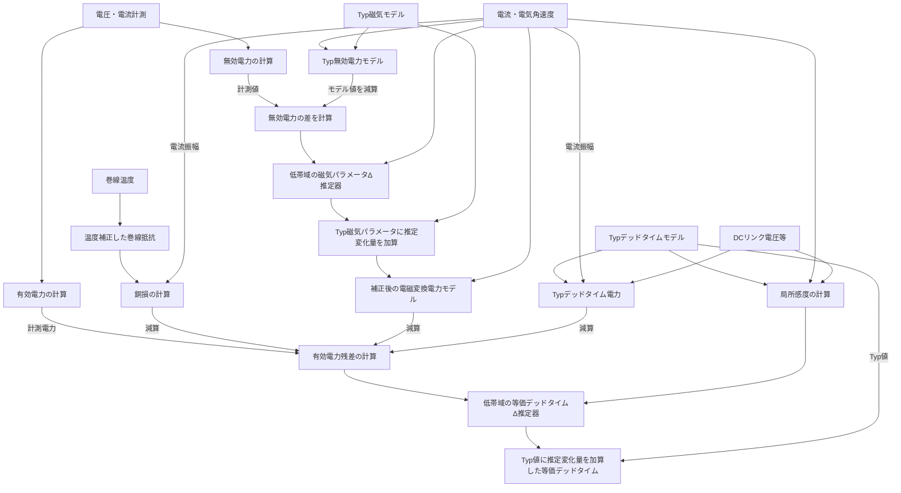
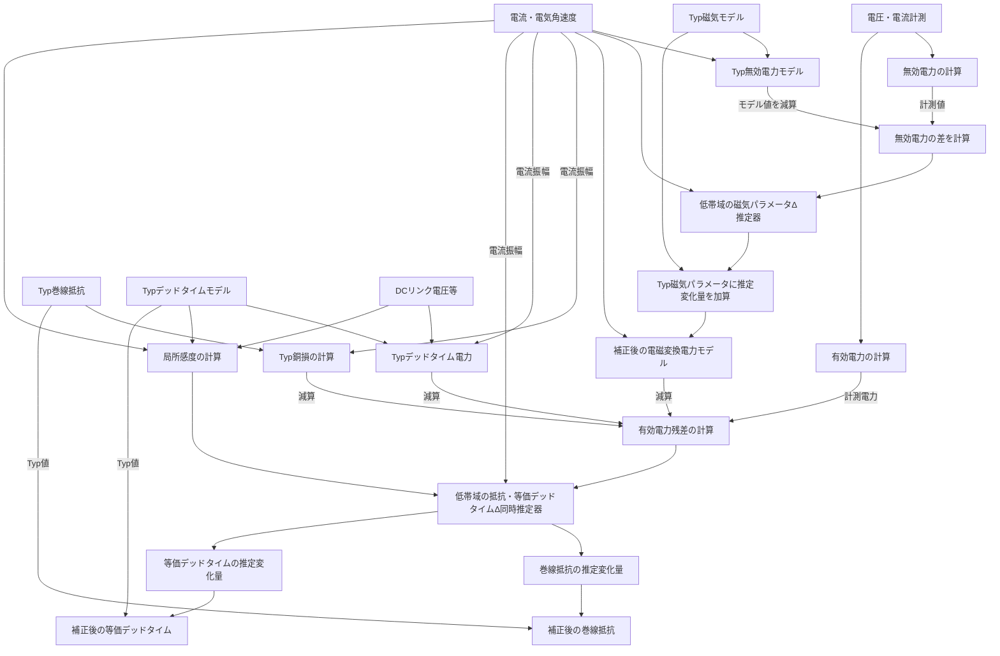
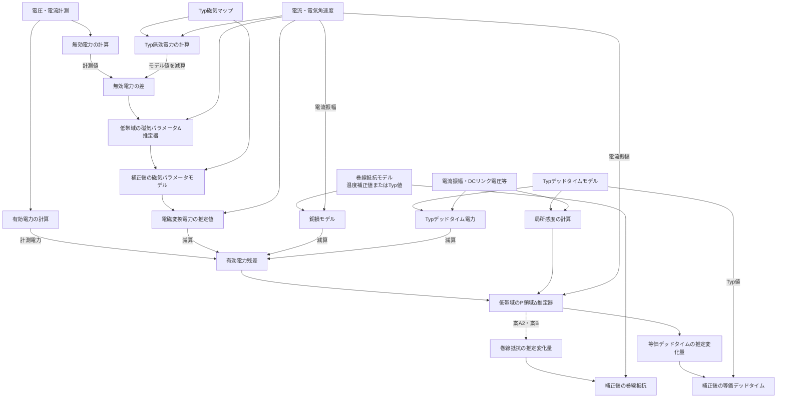
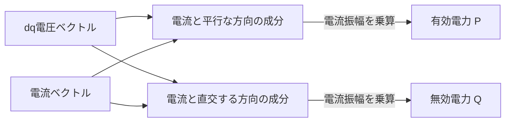
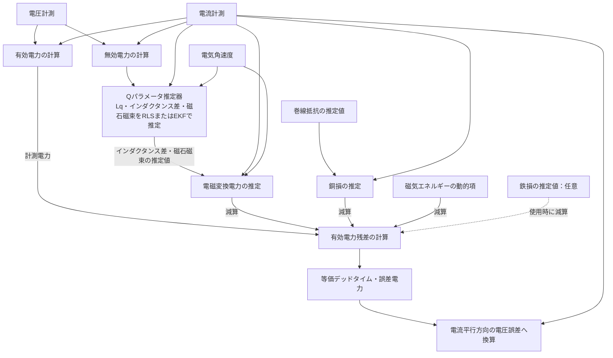
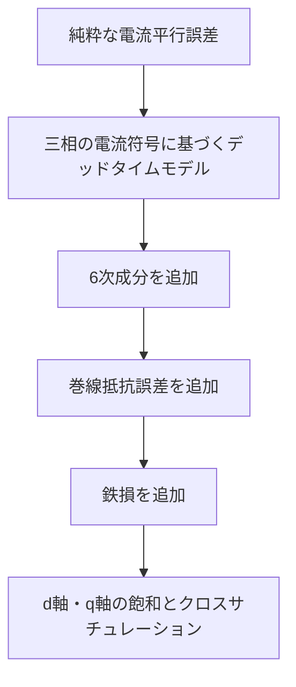

# $Q$-$P$二段$\Delta$推定によるIPMSMパラメータ適応・等価デッドタイム誤差推定 構想

## 1. 目的

IPMSMにおいて、電圧・電流から算出する有効電力

$$
P=v_di_d+v_qi_q
$$

を利用してトルク・電磁変換電力を推定する場合、インバータのデッドタイム等に起因する電圧誤差が直接$P$へ混入する。

特にデッドタイム補償には、

* 素子ばらつき
* 温度依存
* turn-on / turn-off delay
* ダイオード電圧降下
* DCリンク電圧
* 電流値・電流極性
* ゼロクロス近傍の非線形

などによる残差が存在するため、固定値による補償だけでは$P$を高精度に利用することが難しい。

そこで本構想では、

1. **無効電力$Q$を利用して、デッドタイム電圧誤差の主成分を除外しながら磁気パラメータ変化を推定する**
2. **$Q$推定結果を$P$モデルへ戻し、$P$側に残る誤差から等価デッドタイム誤差を推定する**

という2段推定構造を採用する。

また、オンラインでモータパラメータの絶対値を一から同定するのではなく、

$$
\boxed{
\text{Actual}
=
\text{Typ}
+
\Delta
}
$$

という**Typ値＋低速$\Delta$推定**を基本思想とする。

本システムの主目的は高速なパラメータ変動への追従ではなく、温度変化、個体差、経時変化等による比較的低速なモデル変化への適応である。そのため推定帯域は十分低く設定できる。

---

# 2. 基本原理

## 2.1 dq電圧方程式

定常状態のIPMSMを、

$$
\begin{aligned}
v_d &= R_si_d-\omega_eL_qi_q \\
v_q &= R_si_q+\omega_eL_di_d+\omega_e\phi
\end{aligned}
$$

とする。

添付メモでも、この定常dqモデルから$P$、$Q$の関係が整理されている。

---

## 2.2 有効電力$P$

$$
P=v_di_d+v_qi_q
$$

より、

$$
\boxed{
P=
R_s(i_d^2+i_q^2)
+
\omega_e(L_d-L_q)i_di_q
+
\omega_e\phi i_q
}
$$

となる。

すなわち、

$$
P=P_{\mathrm{cu}}+P_{\mathrm{em}}
$$

として、

$$
P_{\mathrm{cu}}=R_sI^2
$$

$$
P_{\mathrm{em}}
=
\omega_e
\left[
(L_d-L_q)i_di_q+\phi i_q
\right]
$$

である。

$P$は電圧ベクトルと電流ベクトルの**内積**であるため、電流方向に存在する電圧誤差が直接$P$へ現れる。

---

## 2.3 無効電力$Q$

本構想では、

$$
Q=v_qi_d-v_di_q
$$

と定義する。

これを展開すると、

$$
\boxed{
Q=
\omega_e
\left(
L_di_d^2+
L_qi_q^2+
\phi i_d
\right)
}
$$

となり、

$$
R_s i_di_q-R_si_di_q=0
$$

によって巻線抵抗成分が完全に消える。

したがって$Q$は、

$$
R_s
$$

に依存せず、

$$
L_d,\ L_q,\ \phi
$$

のみで記述できる。

---

# 3. デッドタイム電圧誤差に対する$Q$の特徴

電流ベクトルを

$$
\mathbf{i}=
\begin{bmatrix}
i_d\\i_q
\end{bmatrix}
$$

とする。

デッドタイムに起因する等価電圧誤差の主成分を、

$$
\Delta\mathbf{v}_{\mathrm{dt}}
\approx
V_{\mathrm{dt}}
\frac{\mathbf{i}}{|\mathbf{i}|}
$$

と近似する。

すなわち基本波成分としては、

$$
\Delta\mathbf{v}_{\mathrm{dt}}\parallel\mathbf{i}
$$

と考える。

$P$に対する影響は、

$$
\Delta P_{\mathrm{dt}}
=
\Delta\mathbf{v}_{\mathrm{dt}}^{T}\mathbf{i}
$$

なので、

$$
\Delta P_{\mathrm{dt}}
\approx
V_{\mathrm{dt}}|\mathbf{i}|
$$

となる。

一方、$Q$は電圧と電流の外積に相当するため、

$$
\Delta Q_{\mathrm{dt}}
=
\Delta\mathbf{v}_{\mathrm{dt}}^{T}J\mathbf{i}
$$

であり、

$$
\Delta\mathbf{v}_{\mathrm{dt}}\parallel\mathbf{i}
$$

ならば、

$$
\boxed{
\Delta Q_{\mathrm{dt}}=0
}
$$

となる。

したがって本方式の基本原理は、

> $Q$がデッドタイム誤差全体に対して不感なのではなく、
> **電流ベクトルに平行なデッドタイム等価電圧誤差の主成分に対して不感である**

という点にある。

実際のインバータでは6次成分、ゼロクロス非線形、素子ばらつき等が存在するため、$Q$への影響が完全にゼロになるわけではない。

ただし本システムでは推定応答を十分遅く設定できるため、これら高速成分をLPF・時間平均によって強く除去できることが期待される。

---

# 4. Typ＋$\Delta$推定という基本思想

モータ磁気パラメータを、

$$
\begin{aligned}
L_d &= L_{d,\mathrm{typ}}+\Delta L_d \\
L_q &= L_{q,\mathrm{typ}}+\Delta L_q \\
\phi &= \phi_{\mathrm{typ}}+\Delta\phi
\end{aligned}
$$

と表す。

実際のIPMSMでは磁気飽和の影響が大きいため、Typ値は単純な定数ではなく、

$$
L_{d,\mathrm{typ}}(i_d,i_q)
$$

$$
L_{q,\mathrm{typ}}(i_d,i_q)
$$

あるいは磁束マップとして持たせてもよい。

この場合の役割分担は、

* **Typモデル**：電流依存性、磁気飽和など大きな既知非線形を表現
* **$\Delta$推定器**：温度、個体差、経時変化など小さく遅いモデル変化を補正

となる。

絶対値同定よりもオンライン推定器の責務を小さくできる。

---

# 5. 第1段：$Q$による磁気パラメータ$\Delta$推定

## 5.1 Typ $Q$モデル

Typ値による$Q$を、

$$
Q_{\mathrm{typ}}
=
\omega_e
\left[
L_{d,\mathrm{typ}}i_d^2
+
L_{q,\mathrm{typ}}i_q^2
+
\phi_{\mathrm{typ}}i_d
\right]
$$

とする。

計測値から、

$$
Q_{\mathrm{meas}}
=
v_qi_d-v_di_q
$$

を求める。

その差、

$$
\Delta Q
=
Q_{\mathrm{meas}}-Q_{\mathrm{typ}}
$$

を取ると、

$$
\boxed{
\Delta Q
=
\omega_e
\left(
i_d^2\Delta L_d
+
i_q^2\Delta L_q
+
i_d\Delta\phi
\right)
}
$$

となる。

したがって、

$$
\boxed{
\Delta\boldsymbol\theta_Q
=
\begin{bmatrix}
\Delta L_d\\
\Delta L_q\\
\Delta\phi
\end{bmatrix}
}
$$

を推定対象とできる。

回帰形式では、

$$
\Delta Q_k
=
\begin{bmatrix}
\omega_e i_d^2&
\omega_e i_q^2&
\omega_e i_d
\end{bmatrix}_k
\Delta\boldsymbol\theta_Q
$$

となる。

---

## 5.2 推定器の帯域

目的は温度等による緩やかな変化への適応であるため、$Q$推定器には高い応答性を要求しない。

例えば、

$$
\Delta Q_f
=
F_{\mathrm{slow}}(s)\Delta Q
$$

として、

* PWMリプル
* デッドタイム6次成分
* 電流センサノイズ
* 電圧演算誤差
* $\mathrm{d}i/\mathrm{d}t$ に起因する過渡成分

を除去した後に$\Delta$推定を行う。

推定アルゴリズムとしては、

* Slow RLS
* 忘却係数を1に近づけたRLS
* 正則化付きRLS
* Slow EKF
* 一定時間窓のLS

等が候補となる。

---

## 5.3 PS性・可同定性

$\Delta$推定であっても、

$$
\Delta L_d,\Delta L_q,\Delta\phi
$$

の3パラメータを完全に分離するには、

$$
[i_d^2,\ i_q^2,\ i_d]
$$

が時間的に十分な独立性を持つ必要がある。

Typ＋$\Delta$化や正則化によって推定を安定化することはできるが、情報そのものが不足している場合のPS性を数学的に解消するものではない。

添付論文でも、複数パラメータの同時同定にはPS性確保が重要であることが整理され、電流へPS確保信号を重畳する構成が採用されている。

ただし今回の用途では高速同定を要求しないため、

> 通常走行中に自然に得られる複数の $i_d,i_q$ 動作点を長時間蓄積して同定する

というアプローチも可能性がある。

---

# 6. $Q$推定値から$P$モデルを補正する

$Q$推定結果から、

$$
\begin{aligned}
\hat L_d
&=
L_{d,\mathrm{typ}}+\Delta\hat L_d\\
\hat L_q
&=
L_{q,\mathrm{typ}}+\Delta\hat L_q\\
\hat\phi
&=
\phi_{\mathrm{typ}}+\Delta\hat\phi
\end{aligned}
$$

を得る。

これを用いて、

$$
\boxed{
\hat P_{\mathrm{em}}
=
\omega_e
\left[
(\hat L_d-\hat L_q)i_di_q
+
\hat\phi i_q
\right]
}
$$

を計算する。

ここで$Q$側によって磁気パラメータ変化が補償されるため、$P$側の残差から、

* $L_d,L_q,\phi$ の温度変化
* Typモデルと実機との磁気特性差

の影響を可能な限り除去できる。

これが第2段推定の前処理となる。

---

# 7. 第2段：$P$による等価デッドタイム$\Delta$推定

デッドタイムを単純な物理的dead timeそのものではなく、

$$
\boxed{
\mathrm{Dt}_{\mathrm{eq}}
=
\mathrm{Dt}_{\mathrm{typ}}
+
\Delta \mathrm{Dt}_{\mathrm{eq}}
}
$$

という**等価デッドタイムパラメータ**として扱う。

等価パラメータには、

* command dead time
* turn-on delay
* turn-off delay
* 素子電圧降下
* ダイオード電圧降下
* 素子温度
* DCリンク電圧
* 電流依存性

等をまとめて包含させる。

Typ値から予測される等価デッドタイム電力を、

$$
P_{\mathrm{dt},\mathrm{typ}}
=
f_{\mathrm{dt}}
(\mathrm{Dt}_{\mathrm{typ}},V_{\mathrm{dc}},I,\ldots)
$$

とする。

そのうえで、$P$残差から

$$
\Delta \mathrm{Dt}_{\mathrm{eq}}
$$

を推定する。

$R_s$の扱いについて、以下の2案を保持する。

---

# 8. 構成案A：$R_s$は温度センサから補正する

## 8.1 考え方

巻線抵抗はオンライン推定せず、巻線温度センサ等から補正する。

基準温度 $T_0$ における抵抗を

$$
R_{s0}
$$

とすると、例えば一次近似で、

$$
\boxed{
R_s(T)
=
R_{s0}
\left[
1+\alpha_R(T-T_0)
\right]
}
$$

とする。

これを、

$$
R_{s,\mathrm{temp}}
$$

として$P$モデルへ使用する。

---

## 8.2 $P$残差

計測$P$を、

$$
P_{\mathrm{meas}}
=
v_di_d+v_qi_q
$$

とする。

モータモデル電力を、

$$
\hat P_{\mathrm{motor}}
=
R_{s,\mathrm{temp}}I^2
+
\hat P_{\mathrm{em}}
$$

とする。

Typデッドタイム電力まで除去して、

$$
\boxed{
r_P
=
P_{\mathrm{meas}}
-
R_{s,\mathrm{temp}}I^2
-
\hat P_{\mathrm{em}}
-
P_{\mathrm{dt},\mathrm{typ}}
}
$$

を作る。

理想的には、

$$
\boxed{
r_P
\approx
\Delta P_{\mathrm{dt}}
}
$$

となる。

デッドタイムモデルを局所的に、

$$
\Delta P_{\mathrm{dt}}
=
g_{\mathrm{dt}}\Delta \mathrm{Dt}_{\mathrm{eq}}
$$

と表せるなら、

$$
\boxed{
\Delta\widehat{\mathrm{Dt}}_{\mathrm{eq}}
=
\mathrm{Estimator}
(r_P,g_{\mathrm{dt}})
}
$$

として、

$$
\boxed{
\widehat{\mathrm{Dt}}_{\mathrm{eq}}
=
\mathrm{Dt}_{\mathrm{typ}}
+
\Delta\widehat{\mathrm{Dt}}_{\mathrm{eq}}
}
$$

を得る。

---

## 8.3 構成

---

## 8.4 長所

* $P$側の推定対象が実質 $\Delta \mathrm{Dt}$ だけになる
* 推定器の次元が低い
* $R_s$と$\mathrm{Dt}$の識別問題を避けられる
* 推定の安定性・説明性が高い
* $Q$側と$P$側の役割が明確になる
* 実装が比較的単純

---

## 8.5 課題

温度センサ温度と実巻線平均温度との差、

* 熱遅れ
* センサ位置
* 巻線内温度分布
* 抵抗温度係数のばらつき

などが、

$$
R_sI^2
$$

のモデル誤差となって$P$残差へ残る。

そのため、

$$
r_P
=
\Delta P_{\mathrm{dt}}
+
\Delta P_{R_s,\mathrm{sensor}}
+\cdots
$$

となり、最終的には$R_s$補正精度が$\Delta \mathrm{Dt}$推定精度を制限する。

---

# 9. 構成案B：$P$側で$\Delta R_s$と$\Delta \mathrm{Dt}$を同時推定する

## 9.1 考え方

$R_s$も、

$$
\boxed{
R_s
=
R_{s,\mathrm{typ}}
+
\Delta R_s
}
$$

として扱う。

$Q$側では$R_s$が数学的に消えるため、

$$
\Delta R_s
$$

は$Q$から同定できない。

そこで磁気パラメータを$Q$で補正した後、$P$側に残る低周波誤差を使って、

$$
\Delta R_s
$$

と

$$
\Delta \mathrm{Dt}_{\mathrm{eq}}
$$

を同時推定する。

---

## 9.2 $P$残差

Typ状態で、

$$
P_{\mathrm{base}}
=
R_{s,\mathrm{typ}}I^2
+
\hat P_{\mathrm{em}}
+
P_{\mathrm{dt},\mathrm{typ}}
$$

を計算する。

すると、

$$
r_P
=
P_{\mathrm{meas}}-P_{\mathrm{base}}
$$

である。

理想化すると、

$$
\boxed{
r_P
\approx
I^2\Delta R_s
+
g_{\mathrm{dt}}\Delta \mathrm{Dt}_{\mathrm{eq}}
}
$$

となる。

したがって、

$$
\boxed{
\Delta\boldsymbol\theta_P
=
\begin{bmatrix}
\Delta R_s\\
\Delta \mathrm{Dt}_{\mathrm{eq}}
\end{bmatrix}
}
$$

を推定対象とする。

---

## 9.3 $R_s$と$\mathrm{Dt}$を分離できる理由

巻線抵抗誤差電力は、

$$
\Delta P_R
=
I^2\Delta R_s
$$

である。

一方、デッドタイムの等価電圧誤差を概略一定とみなせば、

$$
\Delta P_{\mathrm{dt}}
\propto I
$$

となる。

したがって簡略モデルでは、

$$
\boxed{
r_P
=
I^2\Delta R_s
+
I K_{\mathrm{dt}}\Delta \mathrm{Dt}_{\mathrm{eq}}
}
$$

とできる。

このため電流振幅が複数条件を取れば、

$$
I^2
$$

と

$$
I
$$

という異なる回帰成分から、

$$
\Delta R_s
$$

と

$$
\Delta \mathrm{Dt}
$$

を分離できる可能性がある。

---

## 9.4 構成

---

## 9.5 長所

* 巻線温度センサへ依存しない構成が可能
* $R_s$の実値変化そのものを捕捉できる
* 巻線温度推定への展開も可能
* $\mathrm{Dt}$推定と$R_s$推定を同一の$P$残差から行える
* Typ＋$\Delta$という統一的な設計思想にできる

---

## 9.6 課題

$$
\Delta R_s
$$

と

$$
\Delta \mathrm{Dt}
$$

を分離するためには、$P$側にも十分な励振・運転条件変化が必要となる。

特に一定トルク・一定電流の長時間運転では、

$$
I^2
$$

と

$$
I
$$

がほぼ一定となり、両者を分離できない。

また、実際のデッドタイム誤差は単純な

$$
P_{\mathrm{dt}}\propto I
$$

だけではなく、

$$
V_{\mathrm{dc}},I,\theta_i,T_{\mathrm{device}}
$$

等にも依存するため、実機では回帰モデルの設計が重要となる。

---

# 10. 2案を比較する

| 項目         | 案A：$R_s$温度補正                            | 案B：$\Delta R_s$＋$\Delta \mathrm{Dt}$同時推定           |
| ---------- | ------------------------------------ | ------------------------ |
| $Q$側推定       | $\Delta L_d,\Delta L_q,\Delta\phi$ | 同左                       |
| $P$側推定       | $\Delta \mathrm{Dt}$                        | $\Delta R_s,\Delta \mathrm{Dt}$ |
| $R_s$取得       | 温度センサ＋温度係数                           | $P$残差から推定                  |
| $P$推定器次数     | 低い                                   | 高い                       |
| 識別性        | 高い                                   | 運転条件に依存                  |
| センサ依存      | 温度センサ必要                              | 不要にできる                   |
| $R_s$温度推定への展開 | 不要                                   | 可能                       |
| 実装難易度      | 低                                    | 中～高                      |
| PoC向き      | 非常に高い                                | 第2段階向き                   |
| ロバスト性      | 比較的高い                                | モデル設計次第                  |

---

# 11. 両案を排他的にしない構成

現時点では、案Aと案Bをどちらか一方に固定する必要はない。

むしろ温度センサによる$R_s$推定値を**prior**として利用し、その周囲だけを$P$推定器で補正する構成も考えられる。

例えば、

$$
R_s
=
R_{s,\mathrm{temp}}
+
\Delta R_{s,\mathrm{adapt}}
$$

とする。

この場合、

$$
\Delta R_{s,\mathrm{adapt}}
$$

は小さい値になることが期待できる。

$P$残差モデルは、

$$
\boxed{
r_P
=
I^2\Delta R_{s,\mathrm{adapt}}
+
g_{\mathrm{dt}}\Delta \mathrm{Dt}_{\mathrm{eq}}
}
$$

となる。

これは、

* 温度センサを完全には信用しない
* $P$だけで$R_s$全量を推定する必要もない

という中間構成である。

### $R_s$の3レベル構成

最終的には以下の3案を保持できる。

#### A1. 温度補正のみ

$$
R_s=R_{s,\mathrm{temp}}
$$

$P$側：

$$
\Delta \mathrm{Dt}
$$

のみ推定。

#### A2. 温度補正＋微小$\Delta R_s$推定

$$
R_s
=
R_{s,\mathrm{temp}}
+
\Delta R_s
$$

$P$側：

$$
\Delta R_s,\Delta \mathrm{Dt}
$$

を推定するが、$\Delta R_s$には強いゼロpriorを与える。

#### B. 完全オンライン$\Delta R_s$推定

$$
R_s
=
R_{s,\mathrm{typ}}
+
\Delta R_s
$$

$P$側で、

$$
\Delta R_s,\Delta \mathrm{Dt}
$$

を同時推定。

この3段階でPoCを進めれば、$R_s$推定自由度を段階的に増やせる。

---

# 12. 全体アーキテクチャ

本構想を全体として整理すると、

---

# 13. $Q$側と$P$側の役割分担

本構成の特徴は、推定対象を物理的に二群へ分離することである。

## $Q$側：磁気系パラメータ

$$
\boxed{
\Delta\boldsymbol{\theta}_Q
=
[
\Delta L_d,\Delta L_q,\Delta\phi
]^T
}
$$

を担当する。

$Q$を使うことで、

* $R_s$が数学的に消える
* 電流方向のデッドタイム等価電圧誤差が消える

という特徴を利用する。

---

## $P$側：抵抗・インバータ系パラメータ

案Aでは、

$$
\boxed{
\Delta\boldsymbol{\theta}_P=[\Delta \mathrm{Dt}]
}
$$

案Bでは、

$$
\boxed{
\Delta\boldsymbol{\theta}_P=
[
\Delta R_s,\Delta \mathrm{Dt}
]^T
}
$$

を担当する。

つまり概念的には、

$$
\boxed{
Q:\ \text{magnetic model adaptation}
}
$$

$$
\boxed{
P:\ \text{loss / inverter error adaptation}
}
$$

という役割分担となる。

---

# 14. 動的状態での注意

ここまでの基本式は定常状態を前提としている。

実際の動的dqモデルでは、

$$
\mathbf{v}
=
R_s\mathbf{i}
+
\dot{\boldsymbol{\lambda}}
+
\omega_eJ\boldsymbol{\lambda}
$$

となる。

そのため$Q$にも、

$$
Q
=
i_d\dot\lambda_q
-
i_q\dot\lambda_d
+
\omega_e
(\lambda_di_d+\lambda_qi_q)
$$

という動的項が入る。

線形インダクタンスなら、

$$
Q=
L_qi_d\dot i_q
-
L_di_q\dot i_d
+
\omega_e
\left(
L_di_d^2+
L_qi_q^2+
\phi i_d
\right)
$$

となる。

したがって初期実装では、

* 定常判定中だけ推定器を更新する
* $|\mathrm{d}i/\mathrm{d}t|$ が大きい場合は更新停止する
* 長いLPFを通す
* 将来的には動的項をモデルへ追加する

という対応が必要となる。

---

# 15. $P$残差に含まれるその他の成分

$P$残差をそのままデッドタイム電力と断定することはできない。

実際には、

$$
P_{\mathrm{res}}
=
P_{\mathrm{dt}}
+
P_{\mathrm{fe},\mathrm{error}}
+
P_{\mathrm{sensor}}
+
P_{\mathrm{model}}
+\cdots
$$

となる可能性がある。

特に鉄損については、元メモでもギャップ電力との関係が懸念事項として挙げられている。

そのため初期段階では名称として、

$$
P_{\mathrm{dt}}
$$

ではなく、

$$
\boxed{
P_{\mathrm{parallel,res}}
}
$$

あるいは

$$
\boxed{
P_{\mathrm{inv,res}}
}
$$

等の**電流平行方向残差電力**として定義し、その中でデッドタイム支配性を検証する方が安全である。

---

# 16. 本方式の中心仮説

本方式の中心仮説をまとめると、以下となる。

### 仮説1

インバータデッドタイムによる等価電圧誤差の主要成分は電流ベクトルに平行である。

### 仮説2

そのため、$Q$を用いることで主要なデッドタイム電圧誤差を抑制しながら、

$$
L_d,L_q,\phi
$$

の低周波変化を観測できる。

### 仮説3

$Q$から推定した磁気パラメータを$P$モデルへフィードバックすれば、$P$残差から磁気パラメータ変動成分を除去できる。

### 仮説4

残った$P$残差の電流依存性を利用することで、

$$
\Delta \mathrm{Dt}
$$

あるいは、

$$
\Delta R_s,\Delta \mathrm{Dt}
$$

を分離推定できる。

### 仮説5

すべてを絶対値推定せず、

$$
\text{Typ}+\Delta
$$

とすることで、推定器を低帯域・小変化・強priorの問題として構成でき、実機ロバスト性を向上できる。

---

# 17. 初期PoC構成

最初の検証は、以下の順序が望ましい。

## Phase 1：$Q$-$\Delta$推定原理確認

線形IPMSMモデルを使用。

$$
L_d,L_q,\phi=\mathrm{const}
$$

人工的に、

$$
\Delta\mathbf{v}
=
V_{\mathrm{err}}\frac{\mathbf{i}}{I}
$$

を付加する。

確認項目：

* $P$には電圧誤差が現れる
* $Q$では主成分が消える
* $Q$から $\Delta L_d,\Delta L_q,\Delta\phi$ が推定できる
* $V_{\mathrm{err}}$ を変えても$Q$推定値が変化しない

---

## Phase 2：Typ＋$\Delta$構成

意図的に、

$$
L_d=L_{d,\mathrm{typ}}+\Delta L_d
$$

等のオフセットを与える。

$Q$推定器が絶対値ではなく、

$$
\Delta L_d,\Delta L_q,\Delta\phi
$$

のみを正しく追従できることを確認する。

---

## Phase 3：$R_s$既知で$\Delta \mathrm{Dt}$推定

$R_s$を真値または温度補正値として与える。

$P$残差から、

$$
\Delta \mathrm{Dt}
$$

を推定する。

これは構成案AのPoCに相当する。

---

## Phase 4：$\Delta R_s$＋$\Delta \mathrm{Dt}$同時推定

複数電流振幅を与え、

$$
I^2\Delta R_s
$$

と

$$
I K_{\mathrm{dt}}\Delta \mathrm{Dt}
$$

を分離可能か確認する。

これは構成案BのPoCに相当する。

---

## Phase 5：実デッドタイムモデル化

理想的な電流平行誤差を、

$$
\Delta v\propto\mathrm{sgn}(i_{\mathrm{uvw}})
$$

型の三相デッドタイムモデルへ変更する。

確認項目：

* 6次成分の$Q$へのリーク
* LPF帯域と推定誤差
* ゼロクロス近傍
* 電流依存性
* $V_{\mathrm{dc}}$依存性

---

## Phase 6：実機誤差要因追加

順次、

* $R_s$温度変化
* 磁石温度による $\phi$ 変化
* $L_d$/$L_q$飽和変化
* 鉄損
* 電圧センサ誤差
* 電流センサオフセット
* DCリンク電圧誤差

を追加し、誤差分離能力を検証する。

---

# 18. 現時点での推奨構成

開発初期は、

無効電力 $Q$ 側：

$$
\boxed{
\Delta L_d,\Delta L_q,\Delta\phi
}
$$

有効電力 $P$ 側：

$$
\boxed{
\Delta \mathrm{Dt}_{\mathrm{eq}}
}
$$

とし、$R_s$は温度センサ補正値を用いる**構成案A**をベースラインとする。

理由は、まず

> 「$Q$で磁気モデルを適応し、その結果を用いることで$P$からデッドタイム系誤差を分離できる」

という本方式固有の原理を単純な条件で検証できるためである。

その後、

$$
\boxed{
R_s
=
R_{s,\mathrm{temp}}
+
\Delta R_s
}
$$

という中間構成を経て、

$$
\boxed{
R_s
=
R_{s,\mathrm{typ}}
+
\Delta R_s
}
$$

へ拡張する。

したがって$R_s$については現時点で一案に固定せず、

1. **温度補正$R_s$**
2. **温度補正$R_s$＋微小$\Delta R_s$**
3. **Typ $R_s$＋完全オンライン$\Delta R_s$**

の3段階を保持しておく。

---

# 19. 本構想を一文で表現すると

> **IPMSMのTypモデルを基準として、無効電力$Q$の外積特性を利用して電流平行方向のインバータ電圧誤差を抑制しながら磁気パラメータの低周波変化量を推定し、その推定磁気モデルを有効電力$P$へ反映することで、$P$残差から巻線抵抗変化および等価デッドタイム電圧誤差の変化量を二段階で分離適応する。**

より簡潔には、

> **$Q$で磁気系$\Delta$を推定し、補正後の$P$で抵抗・インバータ系$\Delta$を推定する、Typ＋$\Delta$型二段適応方式。**

---
はい。このアイデアはかなりきれいに整理できます。
添付メモの式を読み直すと、本質は単なる「$P$ではなく$Q$を使う」ではなく、

> **電圧モデル誤差を、電流ベクトルに平行な成分と直交する成分に分解し、
> $Q$側でモータパラメータを推定し、$P$側に残った平行成分からインバータ電圧誤差を推定する**

という構造になっています。

添付メモの定常dq式と$P$/$Q$展開は、この原理をほぼそのまま表しています。

---

# 1. まず、$P$と$Q$を「内積・外積」として見る

以下、メモと同じく

$$
P=v_di_d+v_qi_q
$$

$$
Q=v_qi_d-v_di_q
$$

とします。

ベクトルで

$$
\mathbf{v}=
\begin{bmatrix}v_d\\v_q\end{bmatrix},
\qquad
\mathbf{i}=
\begin{bmatrix}i_d\\i_q\end{bmatrix},
\qquad
J=
\begin{bmatrix}
0&-1\\
1&0
\end{bmatrix}
$$

とすれば、

$$
\boxed{P=\mathbf{v}^T\mathbf{i}}
$$

$$
\boxed{Q=\mathbf{v}^TJ\mathbf{i}}
$$

です。

つまり、

* $P$：電圧の**電流方向成分**
* $Q$：電圧の**電流直交方向成分**

を見ている、と解釈できます。

電流方向の単位ベクトルを

$$
\mathbf{e}_i=\frac{\mathbf{i}}{|\mathbf{i}|}
$$

とすると、

$$
\frac{P}{|\mathbf{i}|}
=
\mathbf{v}^T\mathbf{e}_i
$$

一方、

$$
\frac{Q}{|\mathbf{i}|}
=
\mathbf{v}^TJ\mathbf{e}_i
$$

です。

したがって$P$,$Q$は、実質的には次の座標変換です。

これが今回の方式の根本原理です。

---

# 2. なぜ$Q$では$R_s$が消えるのか

定常状態なら、

$$
\mathbf{v}
=
R_s\mathbf{i}
+\omega_eJ\boldsymbol{\lambda}
$$

です。

ここで

$$
\boldsymbol{\lambda}=
\begin{bmatrix}
L_di_d+\psi_m\\
L_qi_q
\end{bmatrix}
$$

とします。

$P$は

$$
P
=
(R_s\mathbf{i}+\omega_eJ\boldsymbol{\lambda})^T\mathbf{i}
$$

なので、

$$
P=
R_s|\mathbf{i}|^2
+
\omega_e
\boldsymbol{\lambda}^T(-J)\mathbf{i}
$$

すなわち

$$
\boxed{
P=
R_s(i_d^2+i_q^2)
+
\omega_e
\left[
(L_d-L_q)i_di_q+\psi_mi_q
\right]
}
$$

となります。

一方$Q$は、

$$
Q
=
(R_s\mathbf{i}+\omega_eJ\boldsymbol{\lambda})^TJ\mathbf{i}
$$

です。

ここで

$$
\mathbf{i}^TJ\mathbf{i}=0
$$

なので、

$$
R_s\mathbf{i}
$$

は完全に消えます。

したがって

$$
\boxed{
Q
=
\omega_e\boldsymbol{\lambda}^T\mathbf{i}
}
$$

すなわち

$$
\boxed{
Q=
\omega_e
\left(
L_di_d^2+
L_qi_q^2+
\psi_mi_d
\right)
}
$$

となります。

これはメモの式そのものです。

---

# 3. デッドタイム誤差にも同じ幾何学が使える

ここが今回の着眼点の中心です。

実際にモータへ印加された電圧と、制御側で扱っている電圧との差を

$$
\Delta\mathbf{v}_{\mathrm{dt}}
$$

とします。

デッドタイム電圧の基本波成分は近似的に、

$$
\boxed{
\Delta\mathbf{v}_{\mathrm{dt}}
\simeq
V_{\mathrm{dt}}\frac{\mathbf{i}}{|\mathbf{i}|}
}
$$

のように、**電流ベクトルと平行または反平行**になります。

すると$P$に対しては

$$
\Delta P_{\mathrm{dt}}
=
\Delta\mathbf{v}_{\mathrm{dt}}^T\mathbf{i}
$$

なので、

$$
\boxed{
\Delta P_{\mathrm{dt}}
\simeq
V_{\mathrm{dt}}|\mathbf{i}|
}
$$

となり、直接現れます。

しかし$Q$では、

$$
\Delta Q_{\mathrm{dt}}
=
\Delta\mathbf{v}_{\mathrm{dt}}^TJ\mathbf{i}
$$

なので、

$$
\Delta\mathbf{v}_{\mathrm{dt}}\parallel\mathbf{i}
$$

なら

$$
\boxed{
\Delta Q_{\mathrm{dt}}=0
}
$$

です。

つまり今回の仮説をより正確に書くと、

> **$Q$はデッドタイム電圧誤差に対して不感なのではなく、
> デッドタイム電圧誤差の「電流平行成分」に対して不感である。**

となります。

この表現がかなり重要です。

---

# 4. 現実のデッドタイムでは完全にはゼロにならない

ここもユーザーの認識どおりです。

三相のデッドタイム誤差は実際には

$$
\Delta v_a\propto \mathrm{sgn}(i_a)
$$

のような矩形状の非線形です。

その基本波成分を見ると電流ベクトルにほぼ平行ですが、高調波を含みます。

したがってdq座標では典型的に、

* DC的な電流平行成分
* 6次リプル
* ゼロクロス近傍の非線形
* 素子ばらつき
* $V_{\mathrm{dc}}$依存
* 温度依存

などが残ります。

したがって、

$$
\Delta Q_{\mathrm{dt}}\approx0
$$

であって

$$
\Delta Q_{\mathrm{dt}}=0
$$

ではありません。

特に**6次成分を$Q$推定器に食わせない処理**は、実装上かなり重要になると思います。

---

# 5. この原理から$Q$パラメータ推定器が自然に出てくる

定常状態なら

$$
Q
=
\omega_e
\left(
L_di_d^2+
L_qi_q^2+
\psi_mi_d
\right)
$$

です。

したがって、線形回帰形にすると

$$
Q_k
=
\begin{bmatrix}
\omega_e i_d^2&
\omega_e i_q^2&
\omega_e i_d
\end{bmatrix}_k
\begin{bmatrix}
L_d\\
L_q\\
\psi_m
\end{bmatrix}
$$

つまり、

$$
\boxed{
y_k=\boldsymbol\phi_k^T\boldsymbol{\theta}
}
$$

として

$$
\boldsymbol{\theta}=
\begin{bmatrix}
L_d\\L_q\\\psi_m
\end{bmatrix}
$$

をRLS等で推定できます。

ここでは

* $R_s$ が入らない
* デッドタイム基本波成分もほぼ入らない

というのが大きな利点です。

---

# 6. ただし、3パラメータを$Q$だけで推定するには励振が必要

ここは非常に重要です。

$Q$は1サンプルにつきスカラ1本です。

したがって、

$$
L_d,\ L_q,\ \psi_m
$$

の3個を同時推定するには、

$$
[i_d^2,\ i_q^2,\ i_d]
$$

が時間的に十分異なる方向を張る必要があります。

単一の定常運転点では当然無理です。

さらに、

> 回転数を変えるだけ

では、

$$
Q=\omega_e(\cdots)
$$

の全体がスケーリングされるだけなので、基本的には新しい独立情報をあまり増やしません。

必要なのは主として**電流動作点の変化**です。

この点は添付論文のPS性の議論と同じです。論文でも、dq定常電流だけでは複数パラメータ同定ができないため、PS確保信号を重畳しています。

したがって、

> $Q$化すると「励振不要」になるわけではない。
> **$R_s$・デッドタイムという外乱方向を消しながら、$L$・$\phi$の同定問題を解く**

と理解するのがよいです。

---

# 7. もっと今回の目的に合ったパラメータ化ができる

私はここがかなり面白いと思います。

トルク／電磁変換電力に本当に必要なのは

$$
L_d,\ L_q
$$

そのものではなく、

$$
\Delta L=L_d-L_q
$$

です。

$P$の電磁変換成分は

$$
\boxed{
P_{\mathrm{em}}
=
\omega_e i_q
\left[
\psi_m+\Delta L\,i_d
\right]
}
$$

です。

一方$Q$は、

$$
\frac{Q}{\omega_e}
=
L_di_d^2+L_qi_q^2+\psi_mi_d
$$

なので、

$$
L_d=L_q+\Delta L
$$

を使うと

$$
\boxed{
\frac{Q}{\omega_e}
=
L_q(i_d^2+i_q^2)
+
\Delta L\,i_d^2
+
\psi_mi_d
}
$$

です。

つまり

$$
\boxed{
\boldsymbol{\theta}_Q=
\begin{bmatrix}
L_q\\
\Delta L\\
\psi_m
\end{bmatrix}
}
$$

と置けます。

この方が今回の用途では合理的です。

なぜなら、$P$側で実際に必要なのは

$$
\Delta L,\psi_m
$$

だからです。

$L_q$ は$Q$式を成立させるための「nuisance parameter」に近い扱いにできます。

---

# 8. さらに、「トルク係数」を直接$Q$から見ることもできる

次のようにまとめます。

$$
K_T
\equiv
\psi_m+\Delta L\,i_d
$$

とすると、

$$
P_{\mathrm{em}}
=
\omega_e i_q K_T
$$

です。

$Q$は

$$
\frac{Q}{\omega_e}
=
L_qI^2+i_dK_T
$$

なので、

$$
\boxed{
K_T
=
\frac{
Q/\omega_e-L_qI^2
}{
i_d
}
}
$$

です。

したがって $L_q$ が既知あるいは別マップで持てるなら、

$$
Q
\rightarrow K_T
\rightarrow P_{\mathrm{em}}
$$

と直接つなげることもできます。

これは

$$
L_d,\ L_q,\ \psi
$$

を全部オンライン同定する構成より、今回の目的にはかなり軽量です。

もちろん $i_d\to0$ で特異になるため、そのまま実装するのではなく、RLS等にする必要があります。

---

# 9. ここからデッドタイム「誤差電力」を求める

$Q$推定器から

$$
\hat{\Delta L},\quad
\hat\psi_m
$$

が得られれば、

$$
\boxed{
\hat P_{\mathrm{em}}
=
\omega_e i_q
\left(
\hat\psi_m+
\hat{\Delta L}i_d
\right)
}
$$

を作れます。

定常状態なら、理想モータ入力電力は

$$
P_{\mathrm{motor}}
=
R_sI^2+P_{\mathrm{em}}
$$

です。

一方、制御側電圧から

$$
P_{\mathrm{calc}}=v_di_d+v_qi_q
$$

を計算します。

すると、

$$
\boxed{
P_{\mathrm{err}}
=
P_{\mathrm{calc}}
-
\hat R_sI^2
-
\hat P_{\mathrm{em}}
}
$$

を作れます。

理想的には、

$$
\boxed{
P_{\mathrm{err}}\approx P_{\mathrm{dt}}
}
$$

です。

これが考えているシステムの中心になります。

---

# 10. ただし、ここで最大の注意点がある

実機では、

$$
P_{\mathrm{err}}=P_{\mathrm{dt}}
$$

とはなりません。

実際には、

$$
\boxed{
P_{\mathrm{err}}
=
P_{\mathrm{dt}}
+\Delta P_{R_s}
+P_{\mathrm{fe}}
+P_{\mathrm{inv,other}}
+P_{\mathrm{sensor}}
+P_{\mathrm{model}}
+\cdots
}
$$

です。

特に重要なのは、

### 巻線抵抗誤差

$Q$では $R_s$ が完全に消えるので、

> **$Q$推定器から$R_s$は推定できません。**

したがって$P$残差からデッドタイムだけ取り出したければ、

$$
R_sI^2
$$

を何らかの方法で別途与える必要があります。

これは方式上の本質的な制約です。

---

# 11. $R_s$とデッドタイムは電流依存性が違う

ただし分離の余地があります。

銅損は

$$
P_{\mathrm{cu}}=R_sI^2
$$

です。

一方、デッドタイム電圧基本波を

$$
\Delta\mathbf{v}_{\mathrm{dt}}
=
V_{\mathrm{dt}}\frac{\mathbf{i}}{I}
$$

とみなすと、

$$
P_{\mathrm{dt}}
=
V_{\mathrm{dt}}I
$$

です。

したがって概念的には

$$
\boxed{
P_{\mathrm{err}}
\simeq
R_sI^2
+
V_{\mathrm{dt}}I
}
$$

という、

* $I^2$依存
* $I$依存

の違いがあります。

電流振幅を複数点振れば、

$$
R_s,\quad V_{\mathrm{dt}}
$$

を分離推定することも原理的には可能です。

これは今回の方式の「第2段階」としてかなり面白いです。

---

# 12. 鉄損はメモの懸念どおり、残差へ入る

手書きメモに

> コア損（鉄損）もこの中に含まれるのでは

という記載があります。

これはそのとおりです。

通常の

$$
R_s,L_d,L_q,\psi
$$

だけのdqモデルには鉄損が明示的に含まれていないため、

$$
P_{\mathrm{calc}}
-
P_{\mathrm{cu}}
-
P_{\mathrm{em}}
$$

を取れば、鉄損も残差側へ来ます。

したがって最初から

> 「デッドタイム誤差電力推定値」

と命名するより、

$$
\boxed{
P_{\mathrm{residual}}
}
$$

または

$$
\boxed{
P_{\mathrm{inverter/error}}
}
$$

としておき、

その中からデッドタイムを分離する構成にした方が安全です。

特に、

* デッドタイム：主に $V_{\mathrm{dc}}, I$, 素子状態依存
* 鉄損：強い回転数・磁束依存

なので、速度スイープをすると分離しやすくなります。

---

# 13. メモにある $d(\Delta P)/dt$ は修正した方がよい

メモ末尾の

$$
T=
\frac{P_n}{\omega_e}
\left(
P_{\mathrm{meas}}-P_{\mathrm{cu}}-\frac{d(\Delta P)}{dt}
\right)
$$

は、そのままだと次元が合いません。

$$
\Delta P
$$

が電力なら、

$$
\frac{d\Delta P}{dt}
$$

は $\mathrm{W/s}$ なので、$\mathrm{W}$から引けません。

おそらく意図していたのは**磁気エネルギーの時間変化**です。

動的dq式では、

$$
\mathbf{v}
=
R_s\mathbf{i}
+
\dot{\boldsymbol{\lambda}}
+
\omega_eJ\boldsymbol{\lambda}
$$

なので、

$$
P
=
R_sI^2
+
\mathbf{i}^T\dot{\boldsymbol{\lambda}}
+
P_{\mathrm{em}}
$$

です。

線形モデルなら、

$$
\mathbf{i}^T\dot{\boldsymbol{\lambda}}
=
\frac{d}{dt}
\left(
\frac12L_di_d^2+
\frac12L_qi_q^2
\right)
$$

です。

したがって動的な電力残差は、

$$
\boxed{
P_{\mathrm{res}}
=
P_{\mathrm{calc}}
-
P_{\mathrm{cu}}
-
P_{\mathrm{mag,dyn}}
-
P_{\mathrm{em}}
}
$$

とするのが自然です。

---

# 14. 実は$Q$側にも動的項がある

定常式だけでなく動的式を使うと、

$$
Q
=
\mathbf{v}^TJ\mathbf{i}
$$

より、

$$
\boxed{
Q
=
\dot{\boldsymbol{\lambda}}^{\,T}J\mathbf{i}
+
\omega_e\boldsymbol{\lambda}^T\mathbf{i}
}
$$

となります。

つまり、

$$
Q=
i_d\dot\lambda_q
-i_q\dot\lambda_d
+
\omega_e(\lambda_di_d+\lambda_qi_q)
$$

です。

線形モデルについて、原文には次の未完式が残っている。

> 未完式（原文）：$Q=L_qi_d\dot i_q-L_q\text{?}$

その直後に記載された完成式は次のとおりである。

$$
\boxed{
Q=
L_qi_d\dot i_q
-
L_di_q\dot i_d
+
\omega_e
\left(
L_di_d^2+
L_qi_q^2+
\psi_mi_d
\right)
}
$$

です。

したがって急速な電流過渡中に、定常$Q$モデルだけで推定するとパラメータ側へバイアスが入ります。

これは実装時に、

* 定常区間だけ更新
* 電流微分項をモデルへ追加
* 更新ゲートを設ける

のどれかが必要です。

---

# 15. システム全体を描くとこうなる

私は第一案を次の構成にします。

そして

$$
\boxed{
\hat{\Delta\mathbf{v}}_{\parallel}
=
\frac{P_{\mathrm{res}}}
{I^2+\varepsilon}
\mathbf{i}
}
$$

とすれば、

**電力誤差から電流平行方向の電圧誤差まで逆算できます。**

ここまで来ると、

$$
P_{\mathrm{res}}
$$

を単に監視するだけでなく、デッドタイム補償へ戻すこともできます。

---

# 16. $P$と$Q$を使うと電圧モデル残差そのものを2方向に分解できる

これはこの方式を説明する上で、かなり強い表現です。

モデル電圧との差を

$$
\Delta\mathbf{v}
=
\mathbf{v}-\hat{\mathbf{v}}_{\mathrm{motor}}
$$

とすると、

$$
r_P
=
\Delta\mathbf{v}^T\mathbf{i}
$$

$$
r_Q
=
\Delta\mathbf{v}^TJ\mathbf{i}
$$

です。

したがって、

$$
\boxed{
\Delta\mathbf{v}
=
\frac{r_P}{I^2}\mathbf{i}
+
\frac{r_Q}{I^2}J\mathbf{i}
}
$$

となります。

つまり、

* $r_P$：電流平行方向のモデル誤差
* $r_Q$：電流直交方向のモデル誤差

です。

今回の方式は、

1. $r_Q$方向を使ってモータパラメータを合わせる
2. 合わせ終わったあとに残る $r_P$をインバータ誤差として見る

という構造だと整理できます。

これはかなり本質的です。

---

# 17. 添付論文との位置づけ

添付の新中論文では、dq電圧方程式をそのまま利用し、

* d軸式から $R_s,L_d,L_q$
* q軸式から $\Phi$

を同定しています。複数パラメータ同定のためにPS信号を加える設計です。

今回考えている方式は、それとは少し違って、

> **dq電圧方程式をそのまま同定に使うのではなく、
> まず $J\mathbf{i}$ を掛けて$Q$へ射影し、
> $R_s$と電流平行電圧誤差を数学的に消してから同定する**

方式だと位置づけられます。

これは比較対象として非常に分かりやすいです。

---

# 18. 最初に作るべき最小構成

最初から$R_s$・鉄損・飽和・6次を全部扱わない方がよいと思います。

まずはこの4段階です。

1. **線形IPMSMモデル**

   $$
   L_d,L_q,\psi={\mathrm{const}}
   $$

2. **人工的に電流平行な電圧誤差を注入**

   $$
   \Delta v_{\mathrm{dt}}=V_{\mathrm{dt}}\frac{i}{|i|}
   $$

3. **$Q$-RLSで**

   $$
   L_q,\Delta L,\psi
   $$

   を推定

4. **$P$残差から**

   $$
   \hat P_{\mathrm{dt}}
   $$

   を復元

ここでまず、

$$
\hat\theta_Q
$$

がデッドタイム電圧誤差を変えても動かず、

$$
P_{\mathrm{res}}
$$

だけが追従することを示せれば、**実現原理のPoCとしてかなり明瞭**です。

その次に、

と一つずつ崩していくのがよいです。

---

## 現時点での「方式の一文」

この方式を一文で表現すると、私はこう整理します。

> **電流ベクトルに平行なインバータ電圧誤差が無効電力の外積演算で除去される性質を利用して、$Q$からIPMSMの磁気パラメータを同定し、その同定値から求めた電磁変換電力と有効電力との差により、電流平行方向のインバータ等価電圧誤差電力を推定する。**

この表現なら、方式の新規性候補と実現原理がかなり明確になります。

次に詰めるべきなのは **「$Q$推定器の状態を $L_d,L_q,\psi$ にするか、$L_q,\Delta L,\psi$ にするか、それともトルク係数 $K_T$ を直接推定するか」** です。今回の最終目的がデッドタイム誤差電力推定なら、私は **$L_q,\Delta L,\psi$ → さらに可能なら $L_q,K_T$** の方向を第一候補にします。
